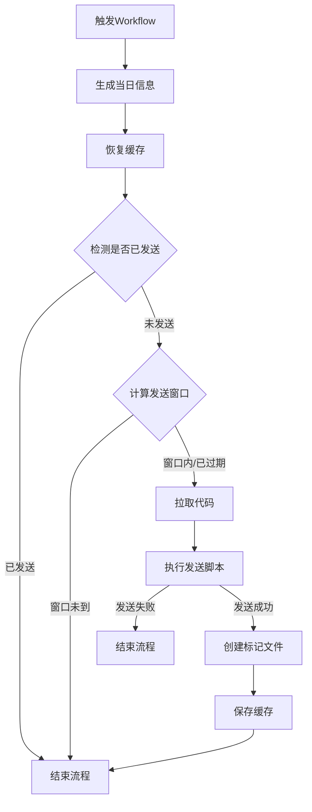

# Telegram Auto Checkin (Verified Stable)
一个基于 GitHub Actions 实现的 Telegram 每日自动签到/消息发送脚本，具备随机发送窗口、补签机制和防重复发送功能，纯缓存方案稳定可靠。

## ✨ 核心特性
- 🕒 **随机发送窗口**：每日在 9:00-14:00 范围内随机生成10分钟发送窗口，避免固定时间发送
- 🔄 **自动补签机制**：目标窗口过期后自动执行补签，确保每日必发
- 🛡️ **防重复发送**：通过 GitHub Actions 缓存持久化标记文件，避免重复执行
- 🚫 **并发控制**：防止同一时间多实例执行导致的冲突
- ⚡ **精简高效**：执行流程清晰，超时控制，资源占用低

## 📋 前置准备
### 1. 获取 Telegram 配置
- `TG_API_ID` / `TG_API_HASH`：从 [my.telegram.org](https://my.telegram.org/) 获取
- `TG_SESSION_STRING`：通过 pyrogram 生成的会话字符串
- `TG_TARGET_USER`：接收消息的用户ID/群组ID
- `TG_MESSAGE`：要发送的签到消息内容

### 2. 配置 GitHub Secrets
在仓库的 `Settings > Secrets and variables > Actions` 中添加以下密钥：
| 密钥名称 | 说明 |
|---------|------|
| `TG_API_ID` | Telegram API ID |
| `TG_API_HASH` | Telegram API Hash |
| `TG_SESSION_STRING` | Pyrogram 会话字符串 |
| `TG_TARGET_USER` | 目标接收者ID |
| `TG_MESSAGE` | 签到消息内容 |

## 🚀 快速部署
1. Fork 本仓库
2. 在仓库中创建 `.github/workflows/checkin.yml` 文件，复制本项目的 YAML 内容
3. 启用 GitHub Actions 功能（Settings > Actions > General > Allow all actions）
4. 手动触发测试：Actions > Telegram Auto Checkin > Run workflow

## ⚙️ 自定义配置
### 修改发送时间范围
修改 YAML 中的环境变量即可调整发送时间范围：
```yaml
env:
  BASE_HOUR_START: 9    # 起始小时（默认9点）
  BASE_HOUR_END: 14     # 结束小时（默认14点）
```

### 修改触发频率
修改 cron 表达式调整检测频率（默认每35分钟检测一次）：
```yaml
on:
  schedule:
    - cron: "*/35 * * * *"  # 每35分钟执行一次
```

## 📝 执行流程


## 🎯 关键逻辑说明
1. **随机窗口计算**：基于仓库哈希和当日日期生成随机种子，确保每个仓库的发送时间不同
2. **缓存机制**：使用绝对路径 `/home/runner/tg_checkin_flag` 存储标记文件，避免路径展开问题
3. **防重复**：发送成功后创建 `sent.today` 文件并保存到缓存，后续触发会检测该文件并跳过执行
4. **补签逻辑**：目标窗口过期后自动执行发送，确保每日至少发送一次

## 📊 日志说明
| 日志信息 | 说明 |
|---------|------|
| ✅ 今日已发送 | 检测到缓存中的标记文件，跳过执行 |
| ⏳ 今日未发送 | 未检测到标记文件，继续执行 |
| 🎯 目标窗口：X点 X-X 分 | 当日随机生成的发送窗口 |
| ⏰ 当前时间：X点 X 分 | 执行时的当前时间 |
| ✅ 发送成功，已创建标记文件 | 消息发送成功并创建标记文件 |

## 🚨 常见问题
### 1. 缓存保存成功但检测不到
- 原因：路径展开不一致导致缓存恢复到错误位置
- 解决：已使用绝对路径 `/home/runner/tg_checkin_flag` 彻底解决

### 2. 重复发送消息
- 原因：缓存未正确保存或恢复
- 解决：发送成功后强制保存缓存，覆盖旧缓存

### 3. 发送窗口过期后未补签
- 原因：窗口判断逻辑错误
- 解决：完善的过期窗口检测逻辑，确保自动补签

## 🛠️ 技术栈
- GitHub Actions：自动化执行环境
- Pyrogram：Telegram 客户端库
- Bash：流程控制和逻辑判断
- GitHub Cache：持久化状态标记

## 📄 许可证
本项目采用 MIT 许可证开源，你可以自由使用、修改和分发。

## 💡 注意事项
1. 请遵守 GitHub Actions 使用规范，避免滥用
2. 建议将触发频率设置为15-60分钟，避免过于频繁
3. 定期检查运行日志，确保脚本正常执行
4. Telegram 会话字符串有效期有限，过期后需要重新生成